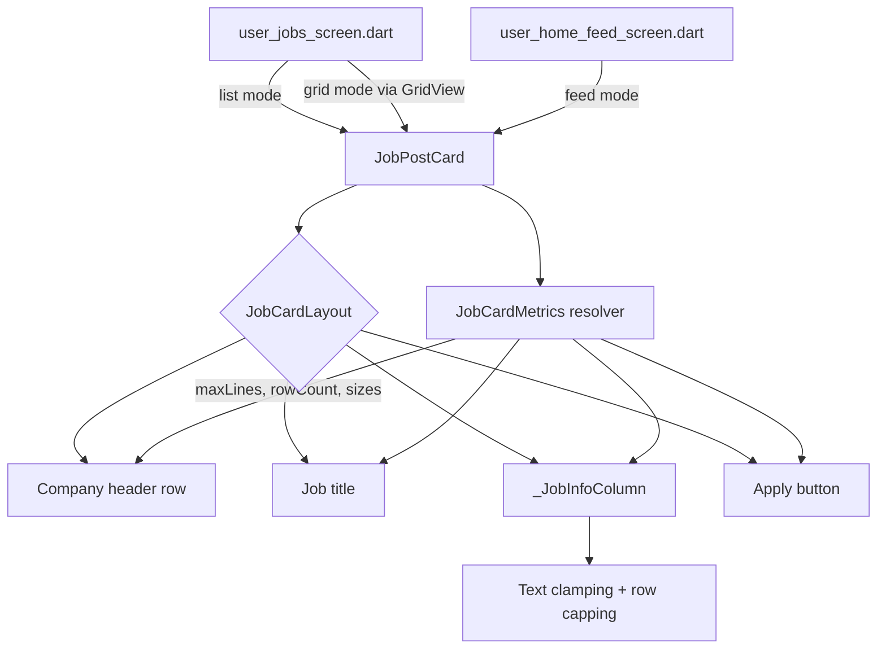
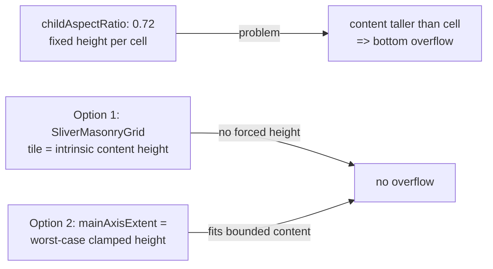
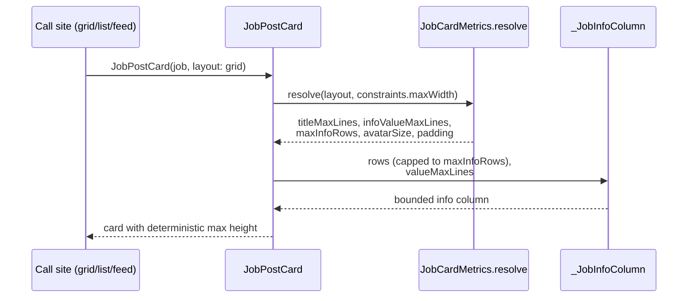

# Design Document: Job Card UI Redesign

## Overview

The candidate jobs screen renders job postings using a shared `JobPostCard` widget. In grid mode (`user_jobs_screen.dart`), cards are laid out in a `GridView.builder` with `SliverGridDelegateWithFixedCrossAxisCount(crossAxisCount: 2, childAspectRatio: 0.72)`. The fixed aspect ratio forces every cell to a fixed height, but the card body grows with its content: the `Column` stacks a company header, the job title, a `_JobInfoColumn` of up to five info rows (including an unbounded multi-line "Yêu cầu"/requirements value), and a 50px apply button. When content exceeds the computed cell height, Flutter renders the "BOTTOM OVERFLOWED BY N PIXELS" striped error (observed at 445, 319, 375 px on different cards).

This redesign solves the overflow while improving the visual quality of the card and preserving correct behavior across the three places the widget is used: the grid view and list view of `user_jobs_screen.dart`, and the vertical list feed in `user_home_feed_screen.dart`. The core strategy is twofold: (1) make per-card content **bounded and predictable** by clamping variable-length text (requirements, location, shift, salary, type) to a fixed number of lines with ellipsis, and capping the number of info rows shown in compact contexts; and (2) replace the rigid `childAspectRatio` grid sizing with **content-driven height** so a card occupies exactly the space its (now bounded) content needs, eliminating both overflow and wasted whitespace.

The widget becomes layout-aware through a `JobCardLayout` mode (`grid`, `list`, `feed`) passed by each call site. The mode controls text clamp limits, which info rows are shown, spacing, and avatar sizing, while a shared visual language (rounded card, company mark, info rows, primary apply button) keeps all three contexts consistent. Sizing adapts responsively to available width so the card looks correct on small phones through tablets.

## Architecture



### Grid sizing strategy

The root cause of the overflow is the fixed-height grid cell. Two complementary changes remove it:

1. **Bounded content** — every variable-length string is clamped to a known maximum number of lines, so a card's maximum intrinsic height is deterministic.
2. **Content-driven cell height** — replace `childAspectRatio` with a delegate that does not force a uniform height. The recommended approach is a masonry-style / staggered layout (`flutter_staggered_grid_view`'s `SliverMasonryGrid`, or `MasonryGridView.count`) where each tile sizes to its own content height. If adding a dependency is undesirable, the fallback is `SliverGridDelegateWithFixedCrossAxisCount` with an explicit `mainAxisExtent` computed from the worst-case clamped content height (a fixed pixel height rather than a ratio), which guarantees the tallest possible bounded card still fits.



## Sequence Diagrams

### Building a card with layout-aware metrics



## Components and Interfaces

### Component 1: JobPostCard (modified)

**Purpose**: Render a single job posting. Now accepts a layout mode and produces bounded content.

**Interface**:
```dart
enum JobCardLayout { grid, list, feed }

class JobPostCard extends StatelessWidget {
  const JobPostCard({
    super.key,
    required this.job,
    required this.onDetailsPressed,
    required this.onApplyPressed,
    this.layout = JobCardLayout.list, // default keeps existing list/feed behavior
    this.distance,
    this.isApplying = false,
    this.isSaved = false,
    this.onSavePressed,
  });

  final JobPost job;
  final JobCardLayout layout;
  // ...existing fields unchanged
}
```

**Responsibilities**:
- Resolve `JobCardMetrics` from `layout` and available width.
- Clamp the job title and all info-row values to the resolved `maxLines`.
- Cap the number of info rows shown to `maxInfoRows`, prioritizing the most useful rows.
- Keep visual styling consistent across layouts.

### Component 2: JobCardMetrics (new)

**Purpose**: Pure value object describing how a card should size and clamp itself for a given layout and width. Centralizes all responsive/clamping decisions so the widget tree stays declarative.

**Interface**:
```dart
class JobCardMetrics {
  const JobCardMetrics({
    required this.titleMaxLines,
    required this.infoValueMaxLines,
    required this.maxInfoRows,
    required this.avatarSize,
    required this.contentPadding,
    required this.applyButtonHeight,
    required this.sectionSpacing,
  });

  final int titleMaxLines;
  final int infoValueMaxLines;
  final int maxInfoRows;
  final double avatarSize;
  final EdgeInsets contentPadding;
  final double applyButtonHeight;
  final double sectionSpacing;

  /// Pure resolver: same inputs always yield the same metrics.
  static JobCardMetrics resolve(JobCardLayout layout, double maxWidth);
}
```

**Responsibilities**:
- Map `(layout, width)` to concrete clamp limits and sizes.
- Apply responsive breakpoints (e.g., narrower grid cells get fewer info value lines / smaller avatar).

### Component 3: _JobInfoColumn (modified)

**Purpose**: Render the capped, clamped set of info rows.

**Interface**:
```dart
class _JobInfoColumn extends StatelessWidget {
  const _JobInfoColumn({
    required this.rows,
    required this.valueMaxLines,
  });

  final List<_JobInfoRowData> rows; // already capped by caller
  final int valueMaxLines;
}
```

**Responsibilities**:
- Render each `_JobInfoRow` with `maxLines: valueMaxLines` and `overflow: TextOverflow.ellipsis` on the value text.

### Component 4: Grid layout owner (user_jobs_screen.dart, modified)

**Purpose**: Provide a non-overflowing grid.

**Responsibilities**:
- Replace `childAspectRatio: 0.72` with content-driven sizing (masonry delegate, or `mainAxisExtent` computed from worst-case bounded height).
- Pass `layout: JobCardLayout.grid` to each card.
- List mode passes `layout: JobCardLayout.list`; feed passes `layout: JobCardLayout.feed`.

## Data Models

### Model: JobCardLayout

```dart
enum JobCardLayout { grid, list, feed }
```

**Validation Rules**:
- Always one of the three defined values; default `list` preserves current list/feed rendering for any unmodified call site.

### Model: JobCardMetrics

| Field | grid (default width ~half screen) | list | feed |
|-------|-----------------------------------|------|------|
| `titleMaxLines` | 2 | 2 | 2 |
| `infoValueMaxLines` | 1 | 2 | 2 |
| `maxInfoRows` | 3 | 5 | 5 |
| `avatarSize` | 40 | 44 | 44 |
| `applyButtonHeight` | 44 | 50 | 50 |

**Validation Rules**:
- `titleMaxLines >= 1`, `infoValueMaxLines >= 1`, `maxInfoRows >= 1`.
- All sizes `> 0`.
- Narrow grid widths (e.g., `maxWidth < 170`) may reduce `maxInfoRows` to 2 and `avatarSize` to 36.

### Info-row priority (for capping in grid)

When `rows.length > maxInfoRows`, keep rows in this priority order and drop the rest:
1. Lương (salary, emphasized) — most decision-relevant
2. Địa chỉ (location / distance)
3. Thời gian (shift time)
4. Yêu cầu (requirements)
5. Hình thức (job type)

> Rationale: salary, location, and time drive candidate decisions in a compact card; requirements and type remain visible in the full details screen.

## Algorithmic Pseudocode

### Algorithm: Resolve card metrics

```dart
// JobCardMetrics.resolve(layout, maxWidth)
static JobCardMetrics resolve(JobCardLayout layout, double maxWidth) {
  // Precondition: maxWidth > 0
  switch (layout) {
    case JobCardLayout.grid:
      final narrow = maxWidth < 170.0;
      return JobCardMetrics(
        titleMaxLines: 2,
        infoValueMaxLines: 1,
        maxInfoRows: narrow ? 2 : 3,
        avatarSize: narrow ? 36 : 40,
        contentPadding: const EdgeInsets.all(14),
        applyButtonHeight: 44,
        sectionSpacing: 12,
      );
    case JobCardLayout.list:
    case JobCardLayout.feed:
      return JobCardMetrics(
        titleMaxLines: 2,
        infoValueMaxLines: 2,
        maxInfoRows: 5,
        avatarSize: 44,
        contentPadding: const EdgeInsets.all(16),
        applyButtonHeight: 50,
        sectionSpacing: 16,
      );
  }
  // Postcondition: all numeric fields > 0; clamp fields >= 1
}
```

### Algorithm: Build bounded info rows (text clamping + row capping)

```dart
// Inside JobPostCard.build, after computing the candidate rows.
List<_JobInfoRowData> buildBoundedRows(
  List<_JobInfoRowData> candidates, // non-empty values only
  JobCardMetrics metrics,
) {
  // Step 1: order by display priority (salary, location, time, requirements, type)
  final ordered = candidates.sortedByPriority();

  // Loop invariant: result never exceeds metrics.maxInfoRows
  final result = <_JobInfoRowData>[];
  for (final row in ordered) {
    if (result.length >= metrics.maxInfoRows) break;
    result.add(row);
  }
  return result;
  // Postcondition: result.length == min(candidates.length, metrics.maxInfoRows)
}
```

The value `Text` widgets are then rendered with clamping:

```dart
Text(
  data.value,
  maxLines: valueMaxLines,            // from metrics.infoValueMaxLines
  overflow: TextOverflow.ellipsis,    // <-- prevents unbounded growth
  style: /* unchanged */,
)
```

And the title:

```dart
Text(
  job.title.trim(),
  maxLines: metrics.titleMaxLines,    // clamp title
  overflow: TextOverflow.ellipsis,
  style: /* unchanged */,
)
```

### Algorithm: Grid sizing (call site)

```dart
// Option 1 (recommended): masonry — each tile sizes to its own content.
MasonryGridView.count(
  shrinkWrap: true,
  physics: const NeverScrollableScrollPhysics(),
  crossAxisCount: 2,
  mainAxisSpacing: 12,
  crossAxisSpacing: 12,
  itemCount: filteredJobs.length,
  itemBuilder: (context, index) => JobPostCard(
    job: filteredJobs[index],
    layout: JobCardLayout.grid,
    // ...callbacks
  ),
);

// Option 2 (no new dependency): fixed worst-case height instead of a ratio.
SliverGridDelegateWithFixedCrossAxisCount(
  crossAxisCount: 2,
  crossAxisSpacing: 12,
  mainAxisSpacing: 12,
  mainAxisExtent: kGridCardMaxHeight, // computed from bounded content
);
```

## Key Functions with Formal Specifications

### Function 1: JobCardMetrics.resolve

```dart
static JobCardMetrics resolve(JobCardLayout layout, double maxWidth)
```

**Preconditions:**
- `maxWidth > 0`.
- `layout` is a valid `JobCardLayout`.

**Postconditions:**
- Returns a non-null `JobCardMetrics`.
- `titleMaxLines >= 1`, `infoValueMaxLines >= 1`, `maxInfoRows >= 1`.
- `avatarSize > 0`, `applyButtonHeight > 0`, `sectionSpacing >= 0`.
- Pure: no side effects; identical inputs yield equal output.

**Loop Invariants:** N/A.

### Function 2: buildBoundedRows

```dart
List<_JobInfoRowData> buildBoundedRows(List<_JobInfoRowData> candidates, JobCardMetrics metrics)
```

**Preconditions:**
- Every element of `candidates` has a non-empty `value`.
- `metrics.maxInfoRows >= 1`.

**Postconditions:**
- `result.length == min(candidates.length, metrics.maxInfoRows)`.
- `result` is order-preserving with respect to the defined priority ordering.
- Input `candidates` is not mutated.

**Loop Invariants:**
- At every iteration, `result.length <= metrics.maxInfoRows`.
- Every item in `result` came from `candidates` (no synthesized rows).

## Example Usage

```dart
// Grid (user_jobs_screen.dart)
JobPostCard(
  job: job,
  layout: JobCardLayout.grid,
  distance: _jobDistances[job.id],
  isSaved: isSaved,
  onDetailsPressed: () => _openDetails(job),
  onApplyPressed: () => _handleApply(job, user),
  onSavePressed: () => ref.read(authControllerProvider.notifier).toggleSavedJob(job.id),
);

// List (user_jobs_screen.dart)
JobPostCard(
  job: job,
  layout: JobCardLayout.list,
  // ...callbacks
);

// Feed (user_home_feed_screen.dart) — default also works
JobPostCard(
  job: job,
  layout: JobCardLayout.feed,
  onDetailsPressed: () => _openDetails(job),
  onApplyPressed: () => _handleApply(job, user),
);
```

## Correctness Properties

### Property 1: No overflow
For all jobs, all layouts, and all screen widths within the supported range, the rendered card produces no `RenderFlex`/bottom overflow. In grid mode the tile height accommodates the bounded content.

### Property 2: Bounded text
For all info-row values and all layouts, the rendered value occupies at most `metrics.infoValueMaxLines` lines; longer text is ellipsized. The title occupies at most `metrics.titleMaxLines` lines.

### Property 3: Row capping
For all candidate row lists, the number of rendered info rows equals `min(candidates.length, metrics.maxInfoRows)`.

### Property 4: Priority preservation
When rows are dropped due to capping, the retained rows are exactly the highest-priority rows per the defined ordering.

### Property 5: Layout determinism
`JobCardMetrics.resolve` is pure — equal `(layout, width)` inputs always produce equal metrics.

### Property 6: Visual parity
All three layouts render the same structural elements (company mark, company name, title, info rows, apply button) using the shared styling.

## Error Handling

### Scenario 1: Missing / empty optional fields

**Condition**: `requirements`, `location`, `shiftTime`, or `salary` is null/empty.
**Response**: The corresponding row is omitted (existing `if (...isNotEmpty)` guards retained). `companyName` falls back to `employerName` then `'Nhà tuyển dụng'`.
**Recovery**: Card renders with whatever rows are present, still bounded by `maxInfoRows`.

### Scenario 2: Extremely long single-token strings (no spaces)

**Condition**: A requirement/location value is one very long token that cannot wrap.
**Response**: `maxLines` + `TextOverflow.ellipsis` clamp it; `softWrap` defaults still apply within the bounded line count.
**Recovery**: No overflow; truncated with ellipsis.

### Scenario 3: Very narrow grid cell

**Condition**: `maxWidth` below the narrow breakpoint (small devices, large text scale).
**Response**: `resolve` reduces `maxInfoRows` and `avatarSize`.
**Recovery**: Content stays within the tile.

### Scenario 4: Large OS text scaling (accessibility)

**Condition**: User sets a large `textScaleFactor`.
**Response**: With masonry sizing (Option 1) tiles grow naturally. With fixed `mainAxisExtent` (Option 2), the extent must be derived with a reasonable scale headroom, or clamp `MediaQuery.textScaler` for the card subtree.
**Recovery**: No overflow within supported scale range; documented as a constraint for Option 2.

## Testing Strategy

### Unit Testing Approach
- `JobCardMetrics.resolve`: assert correct limits per layout and across the narrow breakpoint; assert postconditions (all positive, clamp fields >= 1).
- `buildBoundedRows`: assert `result.length == min(n, maxInfoRows)`, priority preservation, and input immutability.

### Property-Based Testing Approach
- Generate random `JobPost` data (long/short/empty requirement and location strings, varied salary/shift) and random widths; assert P2 (bounded lines), P3 (row count), P4 (priority retained), P5 (resolver determinism).

**Property Test Library**: Dart — no first-class PBT library is standard; use parameterized/table-driven tests in `flutter_test` with randomized inputs (or add `glados` if PBT is desired). Library choice to be confirmed during task planning.

### Widget / Golden Testing Approach
- Pump `JobPostCard` in grid, list, and feed layouts inside constrained boxes mimicking real cell widths; assert no overflow via the test framework's overflow error capture.
- Golden tests for each layout to lock visual parity (P6) and verify ellipsis on long content.
- Reproduce the original bug: a job with a long `requirements` string in a 2-column grid cell must render without the bottom-overflow error.

### Integration Testing Approach
- Pump `user_jobs_screen` grid with a list of jobs including long-content items; toggle list/grid view; assert no overflow in either mode.

## Performance Considerations

- Clamped text reduces layout passes (no unbounded multi-line measuring).
- Masonry grids do a small amount of extra layout work per tile vs. a fixed ratio, but the job lists are short and already use `shrinkWrap: true` with `NeverScrollableScrollPhysics` inside an outer scroll view; impact is negligible.
- `JobCardMetrics.resolve` is O(1) and allocation-light.

## Security Considerations

Not applicable — this is a presentational redesign with no auth, data-handling, or network changes.

## Dependencies

- **Flutter SDK / Material** — existing.
- **`flutter_staggered_grid_view`** — required only if Option 1 (masonry) is chosen for grid sizing; otherwise no new dependency (Option 2 uses built-in `mainAxisExtent`). Final decision deferred to task planning.
- Existing project files touched: `widgets/job_post_card.dart`, `user_jobs_screen.dart`, `user_home_feed_screen.dart`, and `test/job_post_card_test.dart`.
