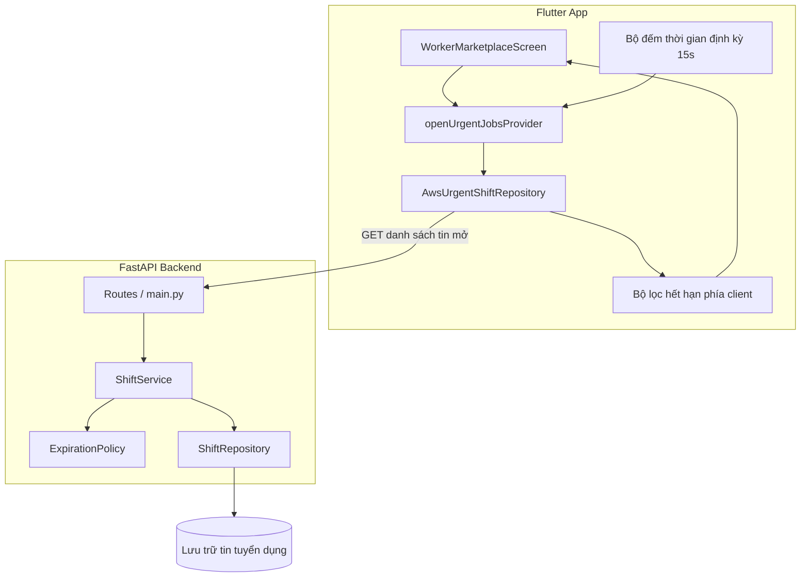
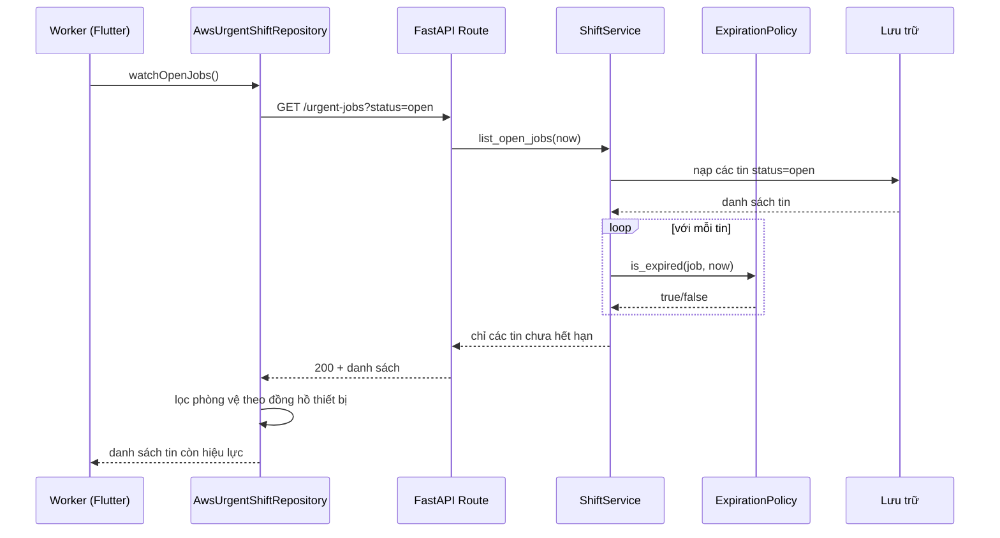
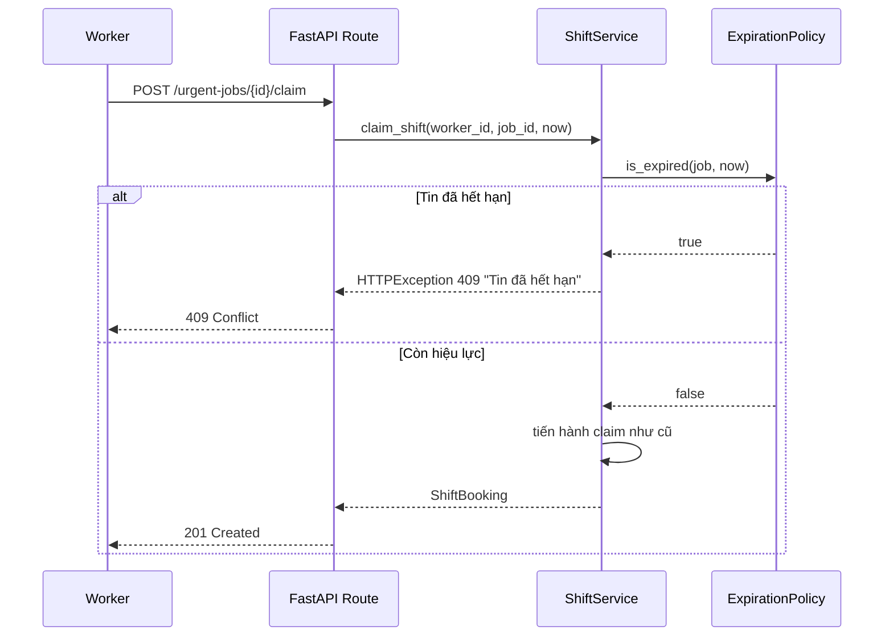
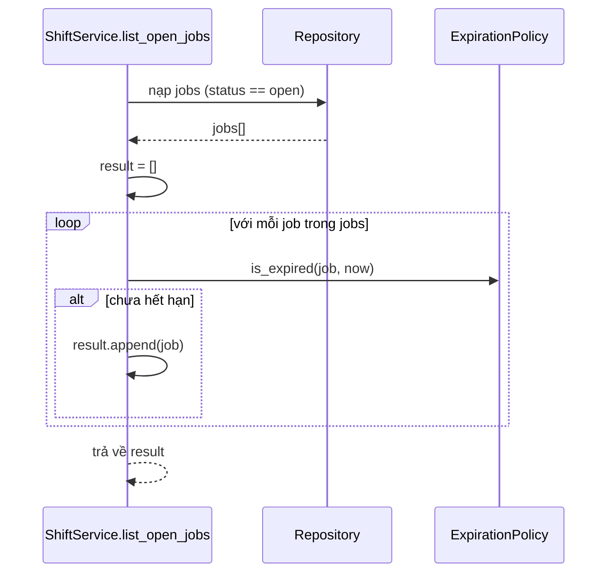
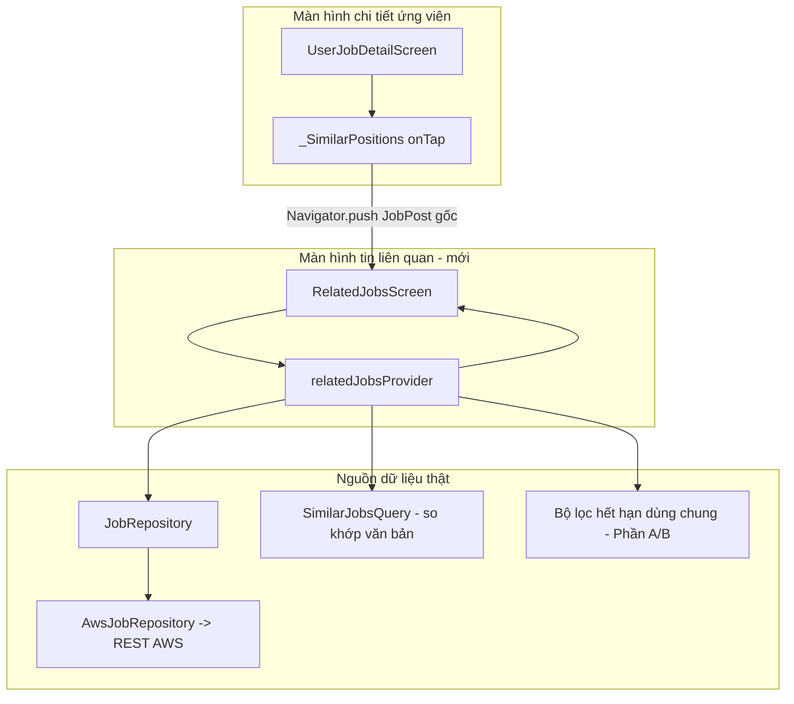
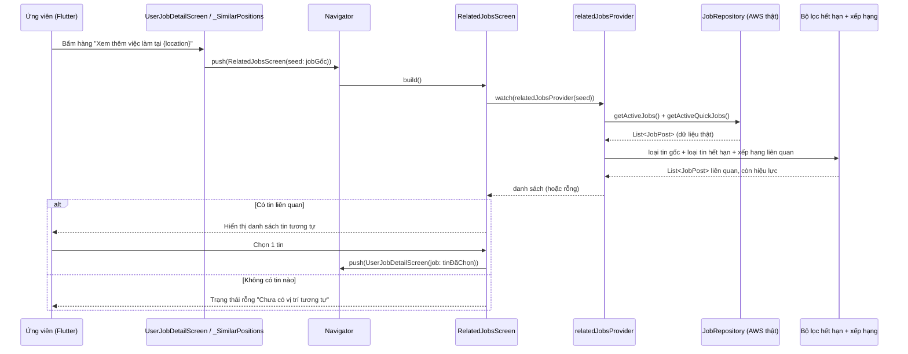

# Tài liệu Thiết kế: Hết hạn tin tuyển dụng (job-posting-expiration)

## Overview

Tính năng này bổ sung khái niệm **thời hạn (deadline) và trạng thái hết hạn (expired)** cho các tin tuyển dụng gấp (`UrgentShiftJob`). Mục tiêu: khi một tin vượt qua thời hạn của nó, tin sẽ **biến mất khỏi các danh sách công khai** (ví dụ chợ việc của worker), người dùng không còn ứng tuyển được nữa, đồng thời chủ tin (employer) vẫn nhìn thấy tin với nhãn "Đã hết hạn" để theo dõi.

Hệ thống hiện tại đã có `start_time` và `end_time` trên mỗi tin, nhưng chưa có khái niệm thời hạn hiển thị/ứng tuyển độc lập. Thiết kế đề xuất thêm một trường thời hạn tường minh là `expires_at` (tùy chọn), và một trạng thái dẫn xuất (derived) `is_expired` được tính tại thời điểm đọc. Việc "biến mất" được thực hiện bằng cách **lọc mềm (soft-hide)** ở tầng backend khi trả về danh sách, kết hợp lọc phòng vệ (defensive filtering) ở client để tin biến mất ngay khi đồng hồ vượt mốc — kể cả giữa hai lần gọi API.

Quyết định chính:
- **Thời hạn tường minh `expires_at` + fallback về `end_time`**: nếu employer không nhập thời hạn riêng, hệ thống coi `end_time` là mốc hết hạn. Điều này tương thích ngược với dữ liệu hiện có mà không cần tạo dữ liệu giả.
- **Soft-hide thay vì hard-delete**: không xóa bản ghi. Tin hết hạn chỉ bị ẩn khỏi danh sách công khai và bị khóa ứng tuyển. Giữ lại dữ liệu để báo cáo, lịch sử, và tránh mất dữ liệu không thể phục hồi.
- **Trạng thái hết hạn được tính tại thời điểm đọc (derived-at-read)**: không dựa vào một job nền bắt buộc phải chạy đúng giờ. Một tin được xem là hết hạn khi `now >= effective_deadline`. Tùy chọn: thêm tác vụ nền dọn dẹp để chuyển `status` sang `expired` nhằm tối ưu truy vấn, nhưng tính đúng đắn không phụ thuộc vào nó.

---

# PHẦN A — THIẾT KẾ TỔNG QUAN (High-Level Design)

## Architecture



Luồng chính:
1. Employer tạo/đăng tin, có thể đặt `expires_at` (tùy chọn). Nếu bỏ trống → dùng `end_time` làm mốc hết hạn.
2. Khi worker mở chợ việc, client gọi endpoint danh sách tin mở. Backend lọc bỏ các tin đã hết hạn trước khi trả về.
3. Client áp thêm một lớp lọc phòng vệ dựa trên đồng hồ thiết bị, để tin biến mất ngay cả giữa hai chu kỳ polling 15 giây.
4. Khi worker cố ứng tuyển vào một tin vừa hết hạn (race condition), backend từ chối bằng lỗi 409.

## Sơ đồ tuần tự — Lọc tin hết hạn khỏi danh sách



## Sơ đồ tuần tự — Ứng tuyển vào tin đã hết hạn (race condition)



## Components and Interfaces

### Backend

#### 1. `ExpirationPolicy` (mới — backend/app/services.py hoặc module riêng)
- **Mục đích**: Tập trung toàn bộ logic xác định mốc hết hạn hiệu lực và trạng thái hết hạn. Là "nguồn sự thật duy nhất" để cả service và repository dùng chung.
- **Trách nhiệm**:
  - Tính `effective_deadline(job)` = `expires_at` nếu có, ngược lại `end_time`.
  - Tính `is_expired(job, now)` = `now >= effective_deadline(job)`.
  - Không có hiệu ứng phụ, không truy cập I/O — thuần tính toán để dễ kiểm thử.

#### 2. `ShiftRepository` (mở rộng — backend/app/repositories.py)
- Thêm `list_open_jobs(now)` trả về các tin có `status == open` **và** chưa hết hạn.
- Thêm `list_employer_jobs(employer_id, now)` trả về toàn bộ tin của employer kèm cờ hết hạn (không ẩn, để employer thấy).
- Tùy chọn: `expire_due_jobs(now)` cho tác vụ nền chuyển `status` sang `expired`.

#### 3. `ShiftService` (mở rộng — backend/app/services.py)
- Bổ sung kiểm tra `is_expired` trong `claim_shift` (chặn ứng tuyển tin hết hạn).
- Cung cấp phương thức danh sách áp dụng `ExpirationPolicy`.

#### 4. Routes (mở rộng — backend/app/main.py)
- Thêm `GET /urgent-jobs` (danh sách tin mở, đã lọc hết hạn) — hiện chưa tồn tại.
- Thêm `GET /urgent-jobs/employer/{employer_id}` (tin của employer kèm cờ hết hạn).

### Client (Flutter)

#### 5. `UrgentShiftJob` (mở rộng — lib/features/urgent_jobs/domain/urgent_shift_job.dart)
- Thêm trường `expiresAt: DateTime?` và getter dẫn xuất `effectiveDeadline`, `isExpired(DateTime now)`.

#### 6. `AwsUrgentShiftRepository` (mở rộng)
- Trong `_mapJob`, đọc thêm `expiresAt` từ payload.
- Trong `watchOpenJobs`, áp bộ lọc phòng vệ: loại các tin `isExpired(DateTime.now())` trước khi phát ra stream.

#### 7. UI (`WorkerMarketplaceScreen`, `ShiftCard`, `JobStatusChip`)
- Marketplace hiển thị thông báo rỗng khi mọi tin đã hết hạn.
- Bảng điều khiển employer hiển thị nhãn "Đã hết hạn".

## Data Models

### `UrgentShiftStatus` (mở rộng enum)
Thêm giá trị `expired` để tùy chọn vật chất hóa trạng thái hết hạn:

| Giá trị | Ý nghĩa |
|---------|---------|
| draft, open, filled, in_progress, completed, cancelled | (giữ nguyên như hiện tại) |
| **expired** | Tin đã qua thời hạn; ẩn khỏi danh sách công khai, không ứng tuyển được |

### `UrgentShiftJob` (mở rộng)

| Trường | Kiểu | Bắt buộc | Mô tả |
|--------|------|----------|-------|
| ...(các trường hiện có)... | | | giữ nguyên |
| `expires_at` | `datetime \| None` | Không | Thời hạn hiển thị/ứng tuyển tường minh. Nếu null → fallback `end_time` |

**Quy tắc kiểm tra (validation)**:
- Nếu `expires_at` được cung cấp: `expires_at > created_at` (không tạo tin đã hết hạn ngay từ đầu) và `expires_at <= end_time` (thời hạn không vượt quá lúc kết thúc ca).
- `effective_deadline` luôn xác định được (vì `end_time` là bắt buộc sẵn).

### `CreateUrgentShiftRequest` (mở rộng)

| Trường | Kiểu | Bắt buộc | Mô tả |
|--------|------|----------|-------|
| `expires_at` | `datetime \| None` | Không | Tùy chọn; nếu bỏ trống, hệ thống dùng `end_time` |

## Error Handling

| Tình huống | Điều kiện | Phản hồi | Phục hồi |
|-----------|-----------|----------|----------|
| Ứng tuyển tin hết hạn | `now >= effective_deadline` lúc claim | HTTP 409 "Tin tuyển dụng đã hết hạn." | Client refresh danh sách, tin biến mất |
| Tạo tin với `expires_at` ở quá khứ | `expires_at <= created_at` | HTTP 422 lỗi validation | Employer chọn lại thời hạn |
| `expires_at > end_time` | vi phạm ràng buộc | HTTP 422 lỗi validation | Employer điều chỉnh |
| Publish tin đã hết hạn | `is_expired` lúc publish | HTTP 409 "Không thể đăng tin đã hết hạn." | Employer cập nhật thời gian |
| Lệch đồng hồ client/server | Chênh múi giờ | Mọi so sánh dùng UTC (`datetime.now(UTC)`) | Chuẩn hóa UTC ở cả hai phía |

## Testing Strategy

### Unit test
- `ExpirationPolicy.effective_deadline`: trả `expires_at` khi có, `end_time` khi null.
- `ExpirationPolicy.is_expired`: đúng tại các mốc biên (`now` ngay trước, bằng, và sau deadline).
- `claim_shift` ném 409 khi tin hết hạn; vẫn hoạt động bình thường khi còn hạn.
- `list_open_jobs` loại đúng các tin hết hạn, giữ tin còn hạn.

### Property-based testing
**Thư viện**: Hypothesis (Python) cho backend; phía Dart kiểm thử ví dụ/biên.

Các thuộc tính đề xuất (chi tiết ở Phần B — Correctness Properties):
- Một tin xuất hiện trong danh sách công khai ⟹ tin đó chưa hết hạn.
- `is_expired` đơn điệu theo thời gian: nếu hết hạn tại `t`, thì hết hạn tại mọi `t' >= t`.
- Lọc backend và lọc client cho cùng kết quả với cùng `now`.

### Integration test
- `GET /urgent-jobs` chỉ trả tin chưa hết hạn (mở rộng backend/tests/test_shift_flow.py).
- Luồng: tạo tin với `expires_at` gần → trước hạn thấy tin, sau hạn không thấy + claim trả 409.

## Cân nhắc hiệu năng

- `is_expired` là phép so sánh O(1); lọc danh sách O(n) theo số tin — không đáng kể.
- Lọc tại thời điểm đọc tránh phụ thuộc job nền. Khi quy mô lớn, bổ sung chỉ mục theo `effective_deadline` và tác vụ nền `expire_due_jobs` để giảm khối lượng quét.
- Client polling 15s đã có sẵn; lớp lọc phòng vệ chạy mỗi lần stream phát, chi phí không đáng kể.

## Cân nhắc bảo mật

- Chỉ employer sở hữu tin mới thấy tin hết hạn của mình (kiểm tra `employer_id`, đã có cơ chế `require_role`).
- Không rò rỉ tin hết hạn ra endpoint công khai.
- Mọi mốc thời gian dùng UTC để tránh thao túng qua múi giờ.

## Phụ thuộc (Dependencies)

- Không thêm thư viện runtime mới. Dùng `datetime`/`UTC` sẵn có ở backend và `DateTime` ở Flutter.
- Kiểm thử: Hypothesis (đã có thể dùng trong môi trường test Python) — bổ sung vào `backend/requirements.txt` nếu chưa có.

---

# PHẦN B — THIẾT KẾ CHI TIẾT (Low-Level Design)

> Tính năng sửa đổi mã Python (backend) và Dart (Flutter) hiện có, nên phần này dùng trực tiếp hai ngôn ngữ đó thay vì pseudocode.

## Thuật toán / Luồng chính



## Kiểu / Giao diện cốt lõi

### Backend — models.py (mở rộng)

```python
class UrgentShiftStatus(StrEnum):
    draft = "draft"
    open = "open"
    filled = "filled"
    in_progress = "in_progress"
    completed = "completed"
    cancelled = "cancelled"
    expired = "expired"  # mới


class CreateUrgentShiftRequest(BaseModel):
    title: str = Field(min_length=3, max_length=120)
    category: str = Field(min_length=2, max_length=80)
    location: Location
    start_time: datetime
    end_time: datetime
    pay_amount: int = Field(gt=0)
    currency: str = Field(default="VND", min_length=3, max_length=3)
    required_workers: int = Field(gt=0, le=100)
    expires_at: datetime | None = None  # mới; null => dùng end_time


class UrgentShiftJob(BaseModel):
    # ...các trường hiện có...
    expires_at: datetime | None = None  # mới
```

### Backend — ExpirationPolicy (mới)

```python
from datetime import datetime
from .models import UrgentShiftJob


class ExpirationPolicy:
    """Nguồn sự thật duy nhất cho logic hết hạn. Thuần tính toán, không I/O."""

    @staticmethod
    def effective_deadline(job: UrgentShiftJob) -> datetime:
        # expires_at tường minh nếu có, ngược lại fallback về end_time.
        return job.expires_at if job.expires_at is not None else job.end_time

    @staticmethod
    def is_expired(job: UrgentShiftJob, now: datetime) -> bool:
        return now >= ExpirationPolicy.effective_deadline(job)
```

### Client — urgent_shift_job.dart (mở rộng)

```dart
class UrgentShiftJob {
  // ...các trường hiện có...
  final DateTime? expiresAt; // mới

  DateTime get effectiveDeadline => expiresAt ?? endTime;

  bool isExpired(DateTime now) =>
      !now.isBefore(effectiveDeadline); // now >= deadline
}
```

## Hàm chính kèm Đặc tả hình thức (Formal Specifications)

### Hàm 1: `ExpirationPolicy.effective_deadline(job)`

```python
def effective_deadline(job: UrgentShiftJob) -> datetime
```

**Tiền điều kiện (Preconditions):**
- `job` hợp lệ; `job.end_time` không null (đã đảm bảo bởi schema).

**Hậu điều kiện (Postconditions):**
- Trả về `job.expires_at` nếu khác null, ngược lại trả về `job.end_time`.
- Luôn trả về một `datetime` xác định (không bao giờ null).
- Không thay đổi `job` (không side effect).

**Bất biến vòng lặp:** Không áp dụng (không có vòng lặp).

### Hàm 2: `ExpirationPolicy.is_expired(job, now)`

```python
def is_expired(job: UrgentShiftJob, now: datetime) -> bool
```

**Tiền điều kiện:**
- `now` ở dạng timezone-aware UTC.
- `effective_deadline(job)` xác định.

**Hậu điều kiện:**
- Trả về `True` khi và chỉ khi `now >= effective_deadline(job)`.
- Đơn điệu: nếu trả `True` tại `now`, thì trả `True` với mọi `now' >= now`.
- Không side effect.

**Bất biến vòng lặp:** Không áp dụng.

### Hàm 3: `ShiftService.list_open_jobs(now)`

```python
async def list_open_jobs(self, now: datetime) -> list[UrgentShiftJob]
```

**Tiền điều kiện:**
- `now` là UTC timezone-aware.

**Hậu điều kiện:**
- Mọi phần tử trả về có `status == open` và `is_expired(job, now) == False`.
- Không tin nào bị thay đổi hay xóa (soft-hide).
- Thứ tự ổn định theo dữ liệu nguồn.

**Bất biến vòng lặp:**
- Tại mỗi bước lặp, `result` chỉ chứa các tin chưa hết hạn đã duyệt trước đó.

### Hàm 4: `ShiftService.claim_shift(worker_id, job_id, now)` (mở rộng)

```python
async def claim_shift(self, worker_id: str, job_id: str, now: datetime) -> ShiftBooking
```

**Tiền điều kiện:**
- `worker_id`, `job_id` không rỗng; `now` UTC.

**Hậu điều kiện:**
- Nếu `is_expired(job, now)` ⟹ ném `HTTPException(409)`, không tạo booking.
- Ngược lại, hành vi như hiện tại (kiểm tra `status == open`, sức chứa...).
- Không có booking nào được tạo cho tin đã hết hạn.

**Bất biến vòng lặp:** Không áp dụng.

## Mã giả thuật toán (Algorithmic Pseudocode)

### Lọc danh sách tin mở (backend)

```pascal
ALGORITHM list_open_jobs(now)
INPUT: now (UTC datetime)
OUTPUT: danh sách UrgentShiftJob chưa hết hạn

BEGIN
  ASSERT now is timezone-aware UTC

  jobs   ← repository.load_jobs_with_status(OPEN)
  result ← empty list

  FOR each job IN jobs DO
    ASSERT all_items_not_expired(result)      // bất biến vòng lặp
    deadline ← (job.expires_at IF job.expires_at ≠ NULL ELSE job.end_time)
    IF now < deadline THEN
      result.append(job)
    END IF
  END FOR

  ASSERT ∀ j ∈ result : j.status = OPEN ∧ now < deadline(j)
  RETURN result
END
```

### Chặn ứng tuyển tin hết hạn (backend)

```pascal
ALGORITHM claim_shift(worker_id, job_id, now)
INPUT: worker_id, job_id, now (UTC)
OUTPUT: ShiftBooking HOẶC lỗi 409

BEGIN
  job ← repository.get_job(job_id)
  deadline ← (job.expires_at IF job.expires_at ≠ NULL ELSE job.end_time)

  IF now ≥ deadline THEN
    RAISE HTTPException(409, "Tin tuyển dụng đã hết hạn.")
  END IF

  // còn hiệu lực → quy trình claim hiện hành
  RETURN repository.claim_shift(worker_id, job_id)
END
```

### Lọc phòng vệ phía client (Flutter)

```pascal
ALGORITHM filter_client_side(jobs)
INPUT: jobs (danh sách trả từ API)
OUTPUT: jobs còn hiệu lực theo đồng hồ thiết bị

BEGIN
  now    ← DateTime.now() chuyển sang UTC
  result ← empty list
  FOR each job IN jobs DO
    deadline ← (job.expiresAt IF job.expiresAt ≠ NULL ELSE job.endTime)
    IF now < deadline THEN
      result.append(job)
    END IF
  END FOR
  RETURN result
END
```

## Ví dụ sử dụng (Example Usage)

### Backend

```python
# Lọc danh sách trong service
now = datetime.now(UTC)
open_jobs = await shift_service.list_open_jobs(now)

# Kiểm tra một tin cụ thể
if ExpirationPolicy.is_expired(job, datetime.now(UTC)):
    raise HTTPException(status.HTTP_409_CONFLICT, "Tin tuyển dụng đã hết hạn.")
```

```python
# Route mới trong main.py
@app.get("/urgent-jobs", response_model=list[UrgentShiftJob])
async def list_open_urgent_jobs(
    service: ShiftService = Depends(get_shift_service),
) -> list[UrgentShiftJob]:
    return await service.list_open_jobs(datetime.now(UTC))
```

### Client (Flutter)

```dart
// Trong AwsUrgentShiftRepository.watchOpenJobs (lớp lọc phòng vệ)
Stream<List<UrgentShiftJob>> watchOpenJobs() async* {
  yield _dropExpired(await _fetchJobs());
  yield* Stream<void>.periodic(const Duration(seconds: 15))
      .asyncMap((_) async => _dropExpired(await _fetchJobs()));
}

List<UrgentShiftJob> _dropExpired(List<UrgentShiftJob> jobs) {
  final now = DateTime.now().toUtc();
  return jobs.where((job) => !job.isExpired(now)).toList(growable: false);
}
```

## Correctness Properties

Các phát biểu lượng từ phổ quát dùng để dẫn xuất kiểm thử thuộc tính:

### Property 1: Không lộ tin hết hạn
`∀ job ∈ list_open_jobs(now) : ¬is_expired(job, now)`
Mọi tin trong danh sách công khai đều chưa hết hạn.

### Property 2: Đơn điệu theo thời gian
`∀ job, ∀ t, t' với t' ≥ t : is_expired(job, t) ⟹ is_expired(job, t')`
Tin đã hết hạn thì không bao giờ "sống lại".

### Property 3: Fallback nhất quán về end_time
`∀ job : job.expires_at = NULL ⟹ effective_deadline(job) = job.end_time`

### Property 4: Tôn trọng deadline tường minh
`∀ job : job.expires_at ≠ NULL ⟹ effective_deadline(job) = job.expires_at`

### Property 5: Tương đương lọc backend ↔ client
`∀ jobs, ∀ now : filter_client_side(jobs, now) = { j ∈ jobs : ¬is_expired(j, now) }`
Với cùng `now`, hai bộ lọc cho cùng tập kết quả.

### Property 6: Bảo toàn dữ liệu (soft-hide)
`∀ now : list_open_jobs(now) không làm giảm tổng số bản ghi trong kho`
Lọc không xóa dữ liệu.

### Property 7: Không tạo booking cho tin hết hạn
`∀ job, ∀ now : is_expired(job, now) ⟹ claim_shift(_, job, now) không tạo booking`

### Property 8: Tính biên (boundary)
`is_expired(job, deadline) = True` và `is_expired(job, deadline − ε) = False`
Mốc hết hạn dùng so sánh `>=` (hết hạn ngay tại thời điểm deadline).

---

# PHẦN C — XEM THÊM THÔNG TIN TỪ "VỊ TRÍ TƯƠNG TỰ" (Tap → View-More-Info)

> Bổ sung này mở rộng màn hình chi tiết công việc của ứng viên: khi ứng viên bấm vào hàng "Xem thêm việc làm tại …" trong mục **"VỊ TRÍ TƯƠNG TỰ"**, hệ thống điều hướng họ sang danh sách các tin liên quan (cùng nhà tuyển dụng / cùng phân loại / cùng địa điểm) để xem thêm thông tin. **Toàn bộ dữ liệu lấy từ nguồn thật đã có trong codebase — không tạo mock/fake data.**

## C.0 Bối cảnh mã nguồn thật (không phát sinh dữ liệu giả)

Tính năng này nằm ở **luồng ứng viên (candidate)** chứ không phải luồng `UrgentShiftJob` của FastAPI. Các thành phần thật liên quan:

| Thành phần thật | Đường dẫn | Vai trò |
|-----------------|-----------|---------|
| `UserJobDetailScreen` | `lib/features/candidate/presentation/user_job_detail_screen.dart` | Màn hình chi tiết; chứa widget `_SimilarPositions` (hiện chỉ là hàng tĩnh có chevron, **chưa có `onTap`**) |
| `_SimilarPositions` | cùng file trên | Hàng "Xem thêm việc làm tại {location}" trong mục "VỊ TRÍ TƯƠNG TỰ" |
| `JobPost` | `lib/features/candidate/domain/job_post.dart` | Model công việc thật (có `employerId`, `title`, `jobType`, `location`, `tags`, `endTime`, `workDate`, …) |
| `JobRepository` | `lib/features/candidate/domain/job_repository.dart` | Hợp đồng `getActiveJobs()`, `getActiveQuickJobs()` |
| `AwsJobRepository` | `lib/features/candidate/data/aws_job_repository.dart` | Gọi REST API AWS thật (`/jobs/active`, `/quick-jobs/active`) |
| `SimilarJobsQuery` | `lib/features/candidate/application/similar_jobs_query.dart` | Logic thuần dự kiến để chuẩn hóa văn bản và xếp hạng tin tương tự nếu tính năng này được triển khai |

**Nguyên tắc dữ liệu**: Danh sách tin tương tự được **dẫn xuất** từ kết quả `getActiveJobs()` + `getActiveQuickJobs()` (các tin đang hoạt động thật), lọc theo các trường thật của `JobPost`. Không hardcode, không sinh dữ liệu mẫu. Nếu không tìm được tin liên quan nào, hiển thị trạng thái rỗng rõ ràng.

## C.1 Architecture (mở rộng High-Level Design)



Luồng:
1. `UserJobDetailScreen` dựng `_SimilarPositions(job: widget.job)` với `job` là `JobPost` thật.
2. Khi ứng viên bấm hàng "Xem thêm việc làm tại …", `_SimilarPositions` gọi callback điều hướng, đẩy sang `RelatedJobsScreen` kèm `JobPost` gốc làm tham chiếu (seed).
3. `RelatedJobsScreen` đọc `relatedJobsProvider` → lấy danh sách tin đang hoạt động thật từ `JobRepository`, loại bỏ chính tin gốc, **loại tin đã hết hạn** (áp đúng quy tắc Phần A/B), rồi xếp hạng theo độ liên quan dựa trên các trường thật (`employerId`, `category/jobType`, `tags`, `location`, `title`).
4. Ứng viên chọn một tin liên quan → mở `UserJobDetailScreen` cho tin đó (tái dùng màn hình chi tiết hiện hữu).

## C.2 Sơ đồ tuần tự — Tap "Vị trí tương tự" → Xem thêm thông tin



## C.3 Components and Interfaces (mở rộng)

### 8. `_SimilarPositions` (sửa — user_job_detail_screen.dart)
- **Thay đổi**: bọc hàng "Xem thêm việc làm tại …" bằng `InkWell`/`GestureDetector` với `onTap`.
- **Trách nhiệm**: chỉ phát sự kiện điều hướng kèm `JobPost` gốc; không tự truy vấn dữ liệu (giữ widget thuần trình bày).
- **Tham số mới**: `final VoidCallback onSeeMore;` (hoặc `onTap`) do `UserJobDetailScreen` truyền xuống.

### 9. `RelatedJobsScreen` (mới — lib/features/candidate/presentation/related_jobs_screen.dart)
- **Mục đích**: hiển thị danh sách tin liên quan tới `JobPost` gốc.
- **Đầu vào**: `final JobPost seed;`
- **Trách nhiệm**:
  - `watch(relatedJobsProvider(seed))`.
  - Hiển thị loading / error / data / empty.
  - Khi chọn một tin → `Navigator.push` sang `UserJobDetailScreen(job: selected)` (tái dùng màn hình chi tiết, có thể bật/tắt nút ứng tuyển như các điểm gọi hiện hữu).

### 10. `relatedJobsProvider` (mới — lib/features/candidate/application/related_jobs_provider.dart)
- **Loại**: `FutureProvider.family<List<JobPost>, JobPost>`.
- **Phụ thuộc**: `jobRepositoryProvider` (đã có), `SimilarJobsQuery` (logic thuần mới nếu triển khai), bộ lọc hết hạn dùng chung.
- **Trách nhiệm**: hợp nhất `getActiveJobs()` + `getActiveQuickJobs()`, loại tin gốc, loại tin hết hạn, xếp hạng theo độ liên quan, cắt `limit`.

### 11. `SimilarJobsQuery` (mới — hàm thuần, lib/features/candidate/application/similar_jobs_query.dart)
- **Mục đích**: logic thuần (không I/O) để lọc + xếp hạng tin tương tự từ một danh sách `JobPost` cho trước. Dễ kiểm thử bằng property-based testing.

## C.4 Quy tắc dẫn xuất "tin tương tự" từ trường dữ liệu thật

Điểm liên quan `relevance(seed, candidate)` được tính từ các trường **thật** của `JobPost`, theo thứ tự ưu tiên:

| Tín hiệu | Trường `JobPost` thật | Trọng số (đề xuất) |
|----------|------------------------|--------------------|
| Cùng nhà tuyển dụng | `employerId` bằng nhau | +50 |
| Cùng loại công việc | `jobType` bằng nhau | +15 |
| Trùng địa điểm | `location` (so khớp token qua `_normalize`/`_textsOverlap`) | +10 |
| Trùng nhãn/kỹ năng | `tags` giao nhau | +5 mỗi nhãn (giới hạn) |
| Trùng tiêu đề | `title` (overlap token) | +8 |

- Vì hàng UI hiện hiển thị "Xem thêm việc làm tại {location}", **tín hiệu địa điểm + nhà tuyển dụng là chủ đạo**; phần còn lại để xếp hạng phụ.
- Nếu triển khai, đặt hàm chuẩn hóa/tokenize trong `SimilarJobsQuery` hoặc tiện ích dùng chung thay vì phụ thuộc vào recommendation service đã bị loại bỏ.
- **Loại trừ chính tin gốc** theo `idJob`.
- **Loại trừ tin đã hết hạn**: nhất quán với Phần A/B — một tin liên quan chỉ hiển thị khi chưa hết hạn.

### Mốc hết hạn cho `JobPost` (nhất quán với Phần A/B)

`JobPost` ở luồng ứng viên không có `expires_at` tường minh, nhưng có `endTime` (chuỗi) và `workDate`. Quy tắc dẫn xuất `JobPost.isExpired(now)`:
- Nếu phân tích được mốc kết thúc từ (`workDate` + `endTime`) → `isExpired = now >= mốc_kết_thúc`.
- Nếu không phân tích được mốc thời gian → coi như **chưa hết hạn** (an toàn, không ẩn nhầm tin còn hiệu lực), vì các tin này vốn đã đến từ endpoint `/active` (đã được backend coi là đang hoạt động).
- Quy tắc này giữ đúng tinh thần "soft-hide" và `>=` tại biên như Phần A/B.

## C.5 Định nghĩa Route / Điều hướng

Hai phương án nhất quán với codebase hiện tại:

**Phương án A (khuyến nghị — đồng nhất với các điểm gọi hiện hữu):** dùng `Navigator.push(MaterialPageRoute(...))`, giống cách `search_page.dart`, `jobs_page.dart`, `candidate_home_page.dart` đang mở `UserJobDetailScreen`.

```dart
// Trong UserJobDetailScreen: truyền callback xuống _SimilarPositions
_SimilarPositions(
  job: widget.job,
  onSeeMore: () => Navigator.of(context).push(
    MaterialPageRoute(
      builder: (_) => RelatedJobsScreen(seed: widget.job),
    ),
  ),
),
```

**Phương án B (nếu muốn dùng go_router):** thêm route khai báo trong `lib/app/router.dart`. Vì `RelatedJobsScreen` cần `JobPost` gốc (không chỉ id, và không có API fetch-by-id ở luồng candidate), truyền qua `extra`:

```dart
GoRoute(
  path: '/jobs/related',
  builder: (context, state) =>
      RelatedJobsScreen(seed: state.extra as JobPost),
),
```

> Khuyến nghị Phương án A để tránh phụ thuộc fetch-by-id chưa tồn tại và giữ đồng nhất với các luồng candidate hiện hành.

## C.6 Hàm chính kèm Đặc tả hình thức

### Hàm 5: `JobPost.isExpired(now)` (mở rộng — job_post.dart)

```dart
bool isExpired(DateTime now)
```

**Tiền điều kiện:** `now` là thời điểm hợp lệ (nên dùng UTC để nhất quán Phần A/B).

**Hậu điều kiện:**
- Trả `true` ⟺ phân tích được mốc kết thúc và `now >= mốc_kết_thúc`.
- Nếu không phân tích được mốc thời gian ⟹ trả `false` (không ẩn nhầm).
- Không side effect.

### Hàm 6: `SimilarJobsQuery.findRelated(seed, all, now, {limit})` (mới)

```dart
List<JobPost> findRelated(
  JobPost seed,
  List<JobPost> all,
  DateTime now, {
  int limit = 20,
})
```

**Tiền điều kiện:**
- `all` là danh sách tin thật (từ `getActiveJobs()` + `getActiveQuickJobs()`).
- `seed` là tin đang xem.

**Hậu điều kiện:**
- Kết quả **không chứa** `seed` (so theo `idJob`).
- Mọi phần tử có `isExpired(now) == false`.
- Mọi phần tử có `relevance(seed, item) > 0` (ít nhất một tín hiệu liên quan).
- Sắp xếp giảm dần theo `relevance`, đồng điểm thì tin mới hơn (`postedAt`) đứng trước.
- Độ dài ≤ `limit`.
- Thuần tính toán, không I/O, không side effect.

**Bất biến vòng lặp:** Tại mỗi bước, tập kết quả tạm chỉ gồm các tin đã duyệt thỏa: khác `seed`, chưa hết hạn, và có liên quan.

### Hàm 7: `relatedJobsProvider(seed)` (mới)

```dart
FutureProvider.family<List<JobPost>, JobPost>
```

**Tiền điều kiện:** `jobRepositoryProvider` khả dụng.

**Hậu điều kiện:**
- Hợp nhất kết quả thật từ `getActiveJobs()` và `getActiveQuickJobs()`.
- Trả về `SimilarJobsQuery.findRelated(seed, hợp_nhất, DateTime.now().toUtc())`.
- Lỗi mạng được truyền qua trạng thái `AsyncError` để UI hiển thị (không nuốt lỗi, không thay bằng dữ liệu giả).

## C.7 Mã giả thuật toán

### Lọc + xếp hạng tin tương tự (client, thuần)

```pascal
ALGORITHM findRelated(seed, all, now, limit)
INPUT: seed (JobPost), all (danh sách JobPost thật), now (UTC), limit
OUTPUT: danh sách JobPost liên quan, còn hiệu lực, đã xếp hạng

BEGIN
  scored ← empty list

  FOR each job IN all DO
    ASSERT all_items_valid(scored)              // bất biến: khác seed, chưa hết hạn, có liên quan
    IF job.idJob = seed.idJob THEN CONTINUE     // loại chính tin gốc
    IF job.isExpired(now) THEN CONTINUE         // nhất quán Phần A/B

    score ← 0
    IF job.employerId = seed.employerId THEN score ← score + 50
    IF job.jobType = seed.jobType THEN score ← score + 15
    IF textsOverlap(job.location, seed.location) THEN score ← score + 10
    score ← score + 5 * |tags(job) ∩ tags(seed)|        // có giới hạn
    IF textsOverlap(job.title, seed.title) THEN score ← score + 8

    IF score > 0 THEN scored.append((job, score))
  END FOR

  SORT scored DESCENDING BY (score, job.postedAt)
  RETURN first `limit` jobs trong scored
END
```

## C.8 Ví dụ sử dụng

```dart
// _SimilarPositions: bọc hàng hiện tại bằng InkWell, giữ nguyên giao diện
InkWell(
  onTap: onSeeMore,
  borderRadius: BorderRadius.circular(10),
  child: Container( /* ...hàng "Xem thêm việc làm tại {location}" giữ nguyên... */ ),
)

// relatedJobsProvider: dùng dữ liệu thật, không mock
final relatedJobsProvider =
    FutureProvider.family<List<JobPost>, JobPost>((ref, seed) async {
  final repo = ref.watch(jobRepositoryProvider);
  final results = await Future.wait([
    repo.getActiveJobs(),
    repo.getActiveQuickJobs(),
  ]);
  final all = [...results[0], ...results[1]];
  return const SimilarJobsQuery()
      .findRelated(seed, all, DateTime.now().toUtc());
});

// RelatedJobsScreen: hiển thị, không tạo dữ liệu giả khi rỗng
ref.watch(relatedJobsProvider(seed)).when(
  loading: () => const Center(child: CircularProgressIndicator()),
  error: (e, _) => Center(child: Text(e.toString())),
  data: (jobs) => jobs.isEmpty
      ? const Center(child: Text('Chưa có vị trí tương tự'))
      : ListView(/* JobPostCard cho từng tin thật */),
);
```

## C.9 Error Handling (mở rộng)

| Tình huống | Điều kiện | Phản hồi | Phục hồi |
|-----------|-----------|----------|----------|
| Lỗi tải danh sách tin liên quan | `getActiveJobs/QuickJobs` ném lỗi | `RelatedJobsScreen` hiển thị thông báo lỗi thật | Cho phép thử lại; không thay bằng dữ liệu giả |
| Không có tin liên quan | `findRelated` trả rỗng | Trạng thái rỗng "Chưa có vị trí tương tự" | — (không bịa tin) |
| Tin liên quan vừa hết hạn | `isExpired(now)` | Bị loại khỏi danh sách | Nhất quán Phần A/B |
| Chọn tin liên quan đã hết hạn (đua) | hết hạn sau khi render | Màn hình chi tiết xử lý như tin thường; ứng tuyển bị chặn 409 (Phần A) | Quay lại, làm mới |

## C.10 Testing Strategy (mở rộng)

### Unit / Example test
- `JobPost.isExpired`: đúng tại biên khi phân tích được mốc; trả `false` khi không phân tích được.
- `findRelated`: loại tin gốc; loại tin hết hạn; chỉ giữ tin có `relevance > 0`; thứ tự giảm dần đúng.

### Property-based testing
**Thư viện**: phía Dart kiểm thử ví dụ/biên (và Hypothesis cho phần backend nếu có dẫn xuất tương ứng).
- Kết quả `findRelated` không bao giờ chứa `seed`.
- Mọi phần tử kết quả đều `!isExpired(now)`.
- Tính đơn điệu theo thời gian: tin đã hết hạn không xuất hiện trở lại ở `now' >= now`.
- Kết quả là tập con của đầu vào (không phát sinh tin mới — không có dữ liệu giả).

## C.11 Correctness Properties (bổ sung)

### Property 9: Không tự tham chiếu
`∀ seed, all, now : seed ∉ findRelated(seed, all, now)`
Tin đang xem không xuất hiện trong danh sách tương tự của chính nó.

### Property 10: Tin tương tự cũng phải còn hiệu lực
`∀ job ∈ findRelated(seed, all, now) : ¬job.isExpired(now)`
Danh sách tương tự loại bỏ tin hết hạn, nhất quán với Phần A/B.

### Property 11: Chỉ dùng dữ liệu thật (không phát sinh)
`∀ seed, all, now : findRelated(seed, all, now) ⊆ all`
Mọi tin hiển thị đều đến từ nguồn thật đầu vào; không có mock/fake data.

### Property 12: Có cơ sở liên quan
`∀ job ∈ findRelated(seed, all, now) : relevance(seed, job) > 0`
Mỗi tin xuất hiện vì ít nhất một tín hiệu thật (nhà tuyển dụng/loại/địa điểm/nhãn/tiêu đề).

### Property 13: Trạng thái rỗng trung thực
`(∄ job ∈ all : relevance(seed, job) > 0 ∧ ¬job.isExpired(now)) ⟹ findRelated(...) = ∅`
Khi không có tin liên quan thật, kết quả rỗng (UI hiển thị trạng thái rỗng, không bịa tin).

### Property 14: Đơn điệu thứ hạng
`∀ a, b ∈ findRelated(...) : index(a) < index(b) ⟹ relevance(seed, a) ≥ relevance(seed, b)`
Danh sách được sắp theo độ liên quan giảm dần.
