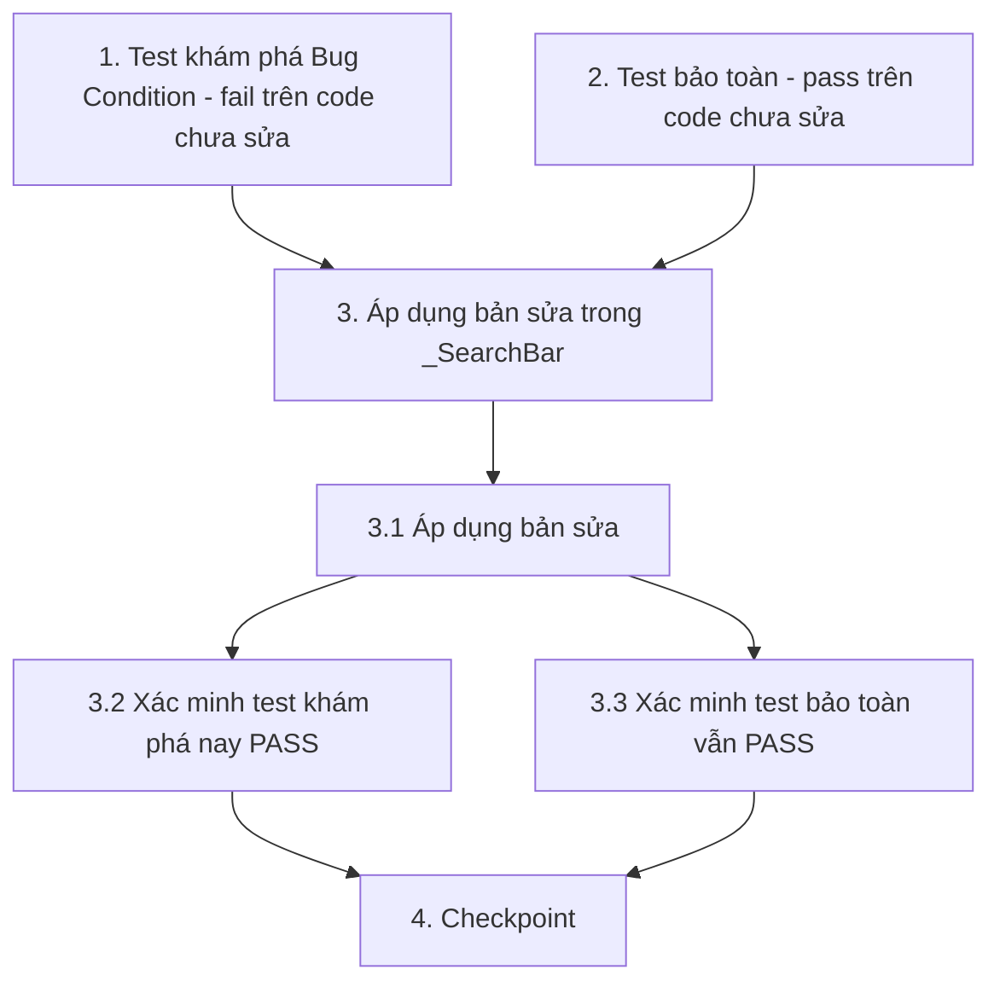

# Implementation Plan

## Overview

Kế hoạch triển khai sửa lỗi con trỏ ô tìm kiếm tràn ra ngoài khung trong `_SearchBar` (`lib/features/messaging/presentation/pages/messages_screen.dart`). Theo quy trình bugfix: viết test khám phá điều kiện lỗi (fail trên code chưa sửa) → viết test bảo toàn (pass trên code chưa sửa) → áp dụng bản sửa → xác minh không hồi quy. Dùng widget test với `flutter test`.

## Tasks

- [x] 1. Viết test khám phá điều kiện lỗi (trước khi sửa)
  - **Property 1: Bug Condition** - Con trỏ tràn ra ngoài khung ô tìm kiếm
  - **QUAN TRỌNG**: Viết test (dạng property-based) này TRƯỚC khi sửa code
  - **BẮT BUỘC**: Test này PHẢI FAIL trên code chưa sửa — thất bại xác nhận lỗi tồn tại
  - **KHÔNG được sửa test hoặc code khi test fail ở bước này**
  - **GHI CHÚ**: Test này mã hóa hành vi mong muốn — khi nó PASS sau khi sửa, nó sẽ xác nhận bản sửa đúng
  - **MỤC TIÊU**: Phơi bày counterexample chứng minh con trỏ vượt quá chiều cao khung
  - **Cách tiếp cận Scoped PBT**: Vì đây là lỗi UI tất định, thu hẹp property về các trạng thái cụ thể của `_SearchBar` trên màn hình Tin nhắn khi focus: (a) ô rỗng chỉ có placeholder, (b) ô đang có nội dung (sinh ngẫu nhiên nhiều chuỗi nhập)
  - Dựng `_SearchBar` trong widget test (`flutter test`), `pumpAndSettle`, focus vào `TextField`
  - Lấy `RenderEditable`/`EditableText` và đo chiều cao con trỏ; lấy chiều cao `Container` (hiện là 44) — từ mục Bug Condition trong design (`caretHeight(X) > containerHeight(X)`)
  - Assertion phải khớp Expected Behavior (Property 1 trong design): `caretHeight(result) <= containerHeight(result)` VÀ con trỏ được căn giữa theo chiều dọc; thêm assert `textAlignVertical == TextAlignVertical.center` và `contentPadding` có padding dọc hợp lý (khác `EdgeInsets.zero`)
  - Chạy test trên code CHƯA sửa
  - **KẾT QUẢ MONG ĐỢI**: Test FAIL (đúng — chứng minh lỗi tồn tại: khung cao 44, thiếu `textAlignVertical`, `contentPadding: EdgeInsets.zero`)
  - Ghi lại counterexample tìm được (ví dụ: "con trỏ cao hơn khung 44px khi focus ô rỗng; `textAlignVertical` = null")
  - Đánh dấu hoàn thành khi test đã viết, đã chạy và thất bại được ghi nhận
  - _Requirements: 1.1, 1.2, 1.3, 2.1, 2.2, 2.3_

- [x] 2. Viết các property test bảo toàn hành vi (trước khi sửa)
  - **Property 2: Preservation** - Giữ nguyên chức năng và hiển thị
  - **QUAN TRỌNG**: Tuân theo phương pháp observation-first — quan sát hành vi trên code CHƯA sửa trước, rồi viết test khẳng định
  - Quan sát trên code chưa sửa cho các input KHÔNG thỏa bug condition (`isBugCondition` = false): gõ/lọc, nút xóa, placeholder, styling khung, và `TextField` màn hình khác
  - Viết property-based test (sinh nhiều chuỗi nhập ngẫu nhiên) khẳng định `onChanged` luôn nhận đúng giá trị đã gõ (Req 3.1)
  - Viết test khẳng định nút xóa (`close_rounded`) hiển thị khi có nội dung và gọi `onClear` khi nhấn (Req 3.2)
  - Viết test khẳng định placeholder "Tìm kiếm cuộc trò chuyện..." giữ nguyên `fontSize: 14` và màu `AppColors.disabledFor` (Req 3.3)
  - Viết test khẳng định màu nền `AppColors.fieldFill`, bo góc radius 12, icon `search_rounded` và bố cục `Row` giữ nguyên (Req 3.4)
  - Viết test khẳng định một `TextField` ở màn hình khác không bị ảnh hưởng (Req 3.5)
  - Chạy các test trên code CHƯA sửa
  - **KẾT QUẢ MONG ĐỢI**: Tất cả PASS (xác nhận baseline cần bảo toàn)
  - Đánh dấu hoàn thành khi test đã viết, đã chạy và pass trên code chưa sửa
  - _Requirements: 3.1, 3.2, 3.3, 3.4, 3.5_

- [x] 3. Sửa lỗi con trỏ tràn ra ngoài khung ô tìm kiếm

  - [x] 3.1 Áp dụng bản sửa trong `_SearchBar`
    - File: `lib/features/messaging/presentation/pages/messages_screen.dart`, hàm `_SearchBar.build`
    - Phóng to chiều cao `Container` từ `height: 44` lên giá trị lớn hơn (khuyến nghị `48`–`52`)
    - Thêm `textAlignVertical: TextAlignVertical.center` cho `TextField`
    - Thay `contentPadding: EdgeInsets.zero` bằng padding dọc hợp lý (ví dụ `EdgeInsets.symmetric(vertical: 8)`)
    - Giữ nguyên `controller`, `onChanged`, `hintText`/`hintStyle`, `border: InputBorder.none`, `style`, màu nền `AppColors.fieldFill`, bo góc radius 12, icon tìm kiếm, bố cục `Row` và nút xóa
    - Không sửa theme/`InputDecorationTheme` toàn cục để không ảnh hưởng màn hình khác
    - _Bug_Condition: isBugCondition(X) — ô tìm kiếm màn hình Tin nhắn focus và caretHeight > containerHeight (từ design)_
    - _Expected_Behavior: caretHeight(result) <= containerHeight(result) AND caretIsVerticallyCentered(result) (từ design)_
    - _Preservation: Preservation Requirements từ design (gõ/lọc/xóa, placeholder, styling, TextField màn hình khác)_
    - _Requirements: 2.1, 2.2, 2.3_

  - [x] 3.2 Xác minh test khám phá điều kiện lỗi nay đã PASS
    - **Property 1: Expected Behavior** - Con trỏ nằm gọn và căn giữa trong khung
    - **QUAN TRỌNG**: Chạy lại CHÍNH test từ task 1 — KHÔNG viết test mới
    - Test từ task 1 mã hóa hành vi mong muốn; khi nó pass tức là hành vi đúng được thỏa mãn
    - **KẾT QUẢ MONG ĐỢI**: Test PASS (xác nhận lỗi đã được sửa)
    - _Requirements: 2.1, 2.2, 2.3_

  - [x] 3.3 Xác minh các test bảo toàn vẫn PASS
    - **Property 2: Preservation** - Giữ nguyên chức năng và hiển thị
    - **QUAN TRỌNG**: Chạy lại CHÍNH các test từ task 2 — KHÔNG viết test mới
    - **KẾT QUẢ MONG ĐỢI**: Tất cả PASS (xác nhận không có hồi quy)
    - _Requirements: 3.1, 3.2, 3.3, 3.4, 3.5_

- [x] 4. Checkpoint - Đảm bảo toàn bộ test pass
  - Chạy `flutter test` và đảm bảo tất cả test pass; hỏi người dùng nếu có vấn đề phát sinh

## Task Dependency Graph



```json
{
  "waves": [
    { "wave": 1, "tasks": ["1", "2"] },
    { "wave": 2, "tasks": ["3.1"] },
    { "wave": 3, "tasks": ["3.2", "3.3"] },
    { "wave": 4, "tasks": ["4"] }
  ]
}
```

## Notes

- Task 1 và Task 2 là các test độc lập (standalone), phải viết và chạy TRƯỚC khi sửa code.
- Task 1 dùng định dạng `Property 1` để hỗ trợ hiển thị trạng thái khi hover; phải FAIL trên code chưa sửa.
- Task 2 dùng định dạng `Property 2`; phải PASS trên code chưa sửa (observation-first).
- Toàn bộ thay đổi khu trú trong `_SearchBar`, không sửa theme toàn cục để tránh ảnh hưởng các màn hình khác.
